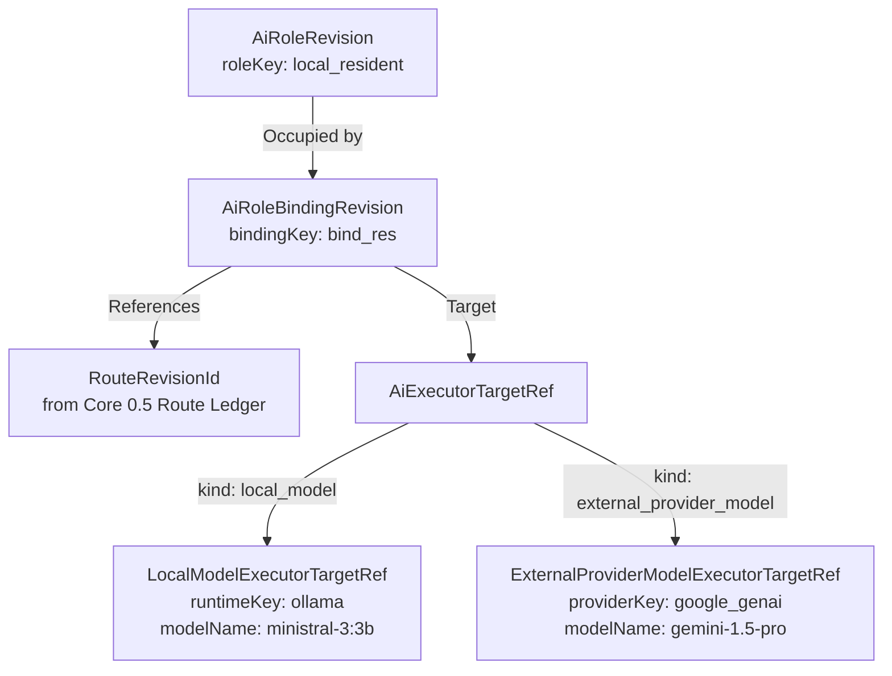

# NEX+ · AI Functional Roles & Incumbent Bindings
**Escopo 0.7A — Especificação Canônica de Papéis e Ocupantes de IA**

---

## 1. Princípio Soberano: Papel Funcional vs. Ocupante Concreto

No NEX+ e no MAX, os consumidores dependem de **Papéis Funcionais estáveis** (`AiRoleKey`), e nunca de nomes de provedores, runtimes, modelos ou marcas comerciais.

- **Função (`AiRoleRevision`)**: Estável e duradoura. Descreve a finalidade de processamento no ecossistema (ex.: `local_resident`, `local_heavy`).
- **Ocupante (`AiRoleBindingRevision` $\rightarrow$ `AiExecutorTargetRef`)**: Substituível e revisável. Representa o executor concreto que atualmente preenche aquele papel.

Quando um modelo superior for homologado ou um provedor for substituído, **nenhum consumidor ou camada de orquestração é renomeado ou reescrito**. Apenas uma nova revisão de binding (`AiRoleBindingRevision`) é emitida, supersedendo a anterior.

---

## 2. Não Confundir Papel com Autoridade

O `AiRole` responde exclusivamente à pergunta:
> *"Qual executor/modelo concreto ocupa atualmente este papel funcional?"*

`AiRole` **NÃO** concede nem transfere:
- Policy ou Termos de Egress;
- Permissões de ACL / Boundary de Dados;
- Confirmação humana ou autorização;
- Elegibilidade de Rota ou Zero-Cost;
- Admissão de Recursos Físicos.

A autoridade sobre privacidade, dados locais (`LOCAL-ONLY`) e elegibilidade permanece estritamente sob o **Core 0.5** (`CapabilityRevision`, `RouteRevision`, `PolicyRevision`, `RouteTermsRevision`).

---

## 3. Estrutura de Contratos

### 3.1. `AiRoleRevision`
Define o papel funcional no registry:
- `roleKey`: Identificador estável (ex.: `local_resident`, `local_heavy`).
- `roleRevisionId`: Identificador único da revisão.
- `lifecycle`: `'active' | 'deprecated' | 'retired'`.
- `supersedesRevisionIds`: Grafo explícito de supersessão.
- `title` e `description`.

### 3.2. `AiExecutorTargetRef` (Union Discriminada)
- `local_model`: Executores locais (`runtimeKey`, `modelName`, `digest` opcional).
- `external_provider_model`: Provedores externos (`providerKey`, `modelName` opcional, `credentialProfileRef` opcional). **NUNCA armazena secrets, tokens ou API keys.**

### 3.3. `AiRoleBindingRevision`
Amarra o papel funcional a um ocupante concreto e a uma rota de execução:
- `bindingKey`: Chave do binding.
- `bindingRevisionId`: Revisão única do binding.
- `roleKey` e `roleRevisionId`: Papel referenciado.
- `routeRevisionId`: Rota de L0 no Route Ledger.
- `target`: Instância de `AiExecutorTargetRef`.
- `supersedesRevisionIds`: Grafo explícito de substituição.

---

## 4. Ocupantes Incumbentes Canônicos Atuais

Os nomes concretos abaixo são **incumbentes operacionais vigentes**, e não identidades arquiteturais permanentes:

| Papel Funcional (`roleKey`) | Runtime | Modelo Incumbente | Justificativa Operacional |
| :--- | :--- | :--- | :--- |
| `local_resident` | `ollama` | `ministral-3:3b` | Baixa latência, footprint contido, resident runtime. |
| `local_heavy` | `ollama` | `qwen3.5:9b` | Raciocínio local complexo e maior capacidade sintática. |

---

## 5. Resolução Determinística e Papéis Unbound

O `resolveAiRole()` é uma função pura e sem efeitos colaterais:
- **Heads Únicos**: Se houver exatamente 1 revisão ativa de papel e 1 revisão ativa de binding $\rightarrow$ `resolved`.
- **Ambiguidade**: Se houver múltiplos heads sem seleção explícita por ID $\rightarrow$ `role_ambiguous` ou `binding_ambiguous`.
- **Papel Unbound (`binding_not_found`)**: Um papel funcional pode ser registrado sem nenhum binding associado (útil para reservar papéis de redundância antes da homologação física).
- **Sem Roteamento Mágico**: O resolver não seleciona por preço, velocidade ou scores de benchmark.

---

## 6. Integração com Resource Governor (Core 0.6)

Para ocupantes locais do tipo `local_model` compatíveis com Ollama:
- O adapter `toApprovedLocalModelRef()` projeta o target em `ApprovedLocalModelRef` (`runtime: 'ollama_local'`).
- O helper `createResourceRequestFromResolvedRole()` gera um `ResourceRequest` contendo `targetModel = resolved.target.modelName`.
- O Resource Governor continua avaliando soberanamente a admissão física de memória RAM, VRAM e estado de carga via `/api/ps`.
